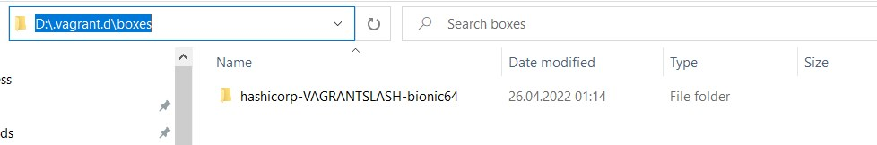

# Set of settings that should be changed 

## 1. Base image files location
By default on Windows base images (the one which Vagrant can for example download from public repository) are located in 
> C:\Users\{username}\.vagrant.d\boxes
which is not a best location if you have other, bigger or faster disk

According to documentation
https://www.vagrantup.com/docs/other/environmental-variables
this setting is controlled by VAGRANT_HOME environment variable

To be on the safe site, I have set the variable both for the user and for the system


After a system restart I added a official Hashicorp with following command

> vagrant box add hashicorp/bionic64

The downloaded base image was in the newly specified folder


## When vagrant fails to destroy (or provision) box

When vagrent tells something like
```
An action 'destroy' was attempted on the machine 'default',
but another process is already executing an action on the machine.
Vagrant locks each machine for access by only one process at a time.
Please wait until the other Vagrant process finishes modifying this
machine, then try again.
```

I log to the box (assuming that this happens when box is running) amd type this:
```
sudo killall apt apt-get
sudo dpkg --configure -a
```
I found this solution there > https://askubuntu.com/questions/1109982/e-could-not-get-lock-var-lib-dpkg-lock-frontend-open-11-resource-temporari  
with comment "this can seriously break your system". Well... fortunately I just wanted to destroy whole VM :wink:
