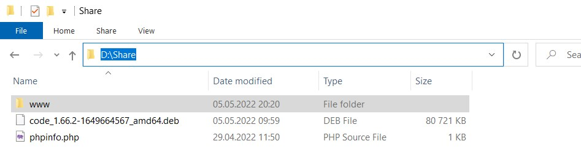
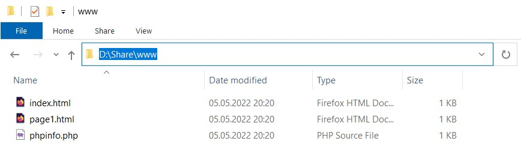
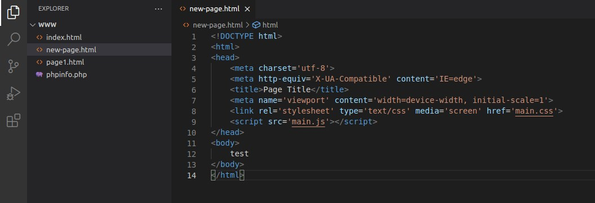
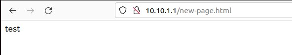

# How to create an isolated Test-Dev environment

## General requirements

The goal is to create environment with two VMs (called server and client) which can talk to each other, but not to any other entities.  
In this scenario I assume that I would like to have working Apache / PHP on a server box and Visual Studio Code installed on client box. Both boxes will have access to the same shared folder on host to keep the web page files there

To install basic packages I will follow guides on 

> https://ubuntu.com/server/docs/web-servers-apache

> https://ubuntu.com/server/docs/programming-php

> https://code.visualstudio.com/docs/setup/linux


## Prerequisites

I have a catalog on my Windows host d:\share with a subfolder www in it.
Also in the share folder I have a Visual Studio Code package  which I downloaded from the internet (available here > https://code.visualstudio.com/download) and a simple php page which displays phpinfo. All this looks like this




## How I did this


### Two boxes (or more) in one vagrantfile

It is possible to place two box definitions in one vagrantfile. 
This requires separate section for each box. Then it is enough to point to the desired box by its name.

Initial structure of vagrantfile is like this:
```
Vagrant.configure("2") do |config|
  config.vm.define "server" do |server|
    server.vm.box = "myUbuntu2204"
  end

  config.vm.define "client" do |client|
    client.vm.box = "myUbuntu2204"
  end

end
```

### Increase VM size (RAM and CPU)

It turned out that provisioned boxes run very slow. So, because I have decent amount of RAM and few spare cored on my host machine, I decided to increase size of both boxes

To do that I simply (following > https://www.vagrantup.com/docs/providers/virtualbox/configuration ) added this section to vagrantfile

```
server.vm.provider "virtualbox" do |v|
  v.memory = 8192
  v.cpus = 8
end
```

```
client.vm.provider "virtualbox" do |v|
  v.memory = 4096
  v.cpus = 4
end
```


### Private network

To declare a private network common for both server and client I added following line to both configuration (of course wih different IP's)

```
server.vm.network "private_network", ip: "10.10.1.1", netmask: "24", virtualbox__intnet: "mynet"
client.vm.network "private_network", ip: "10.10.1.2", netmask: "24", virtualbox__intnet: "mynet"
```
Few explanations there. 
- ***virtualbox__intnet*** directive tells Vagrant to create an internal network. Without this an host-only network is created
- ***"mynet"*** is the name of internal network in Virtual Box. It was a completely new network - created during deployment. But it also can be any existing internal network.
- with ***adapter: "1"*** directive it is possible to tell vagrant which NIC should be used. When I tried it Vagrant was not able to connect to box to provision anything.


More information regarding network can be found there

> https://www.vagrantup.com/docs/providers/virtualbox/networking


### Share files

The idea there is to have a singe point (folder on host) with all the necessary files and a the complete web site.
Folder (in my case c:\share) with config files, packages etc. is mounted to server and client boxes in user vagrant home directory. 

```
server.vm.synced_folder "d:\\share", "/home/vagrant/share", owner: "vagrant"
client.vm.synced_folder "d:\\share", "/home/vagrant/share", owner: "vagrant"
```

Additionally subfolder for web site files is mounted to server box to directory where Apache keep files. 

```
server.vm.synced_folder "d:\\share\\www", "/var/www/html/", create: true
```

Since client box also have access to this catalog I can use Visual Studio Code  to edit files which will be instantaneously visible for all who open the web page. 

Yes - this concept is a bit lame, but this is Vagrant exercise to test what it can do. 
Thus the idea to copy files from different sources to web catalog is also more a presentation Vagrant features than a real world case.

Few deferent methods to copy files to box:
 - from the public website:
 ```
 sudo wget --no-check-certificate https://raw.githubusercontent.com/cloudZeroToHero/DevOpsCamp/main/Vagrant/Code/Test-Dev-Env/index.html -O /var/www/html/index.html
 ```


 - form the same catalog where the vagrant file is located (with use of file provisioner)
 ```
 server.vm.provision "file", source: ".\\page1.html", destination: "/var/www/html/page1.html"
 ```


 - from folder shared from host machine
  ```
  cp /home/vagrant/share/phpinfo.php /var/www/html/phpinfo.php
  ```


### How to install Apache and PHP environment 

This is just a basic shell provisioning (just to show hot it can be done)
```
      sudo apt-get install -y apache2
      sudo apt-get install -y php libapache2-mod-php

```

### How to instal VisualStudioCode

Installation manual is available there
> https://code.visualstudio.com/docs/setup/linux

I have downloaded the installation package to folder shared with client box. 
To install it I use following command
```
sudo apt install -y /home/vagrant/share/code_1.66.2-1649664567_amd64.deb
```


## Let's put it all together

To start the environment I run 
```
vagrant up --provider virtualbox
```

This creates two VMs, and populate d:\share\www with three files



When I open web browser on client box (ensure that this is not http**s**)

> http://10.10.1.1./

I can see my beautiful web page and the phpinfo 

> http://10.10.1.1./phpinfo.php 

Now I'll try to create new page



which I can see on the server




Seems that goal is achieved ! :smile:
Whole vagrantfile is available there

> https://github.com/cloudZeroToHero/DevOpsCamp/blob/main/Vagrant/Code/Test-Dev-Env/Vagrantfile


