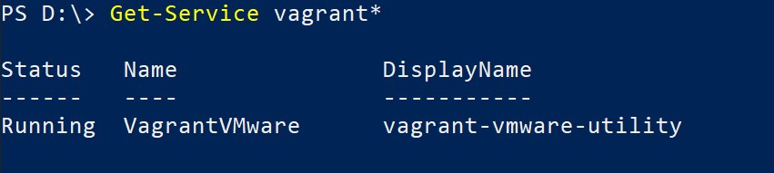

# Is it possible to run Vagrant against VMware Workstation Player ?

VMware provider documentation is available under
> https://www.vagrantup.com/docs/providers/vmware 

## First step is to download and install Vagrant VMware Utility:
> https://www.vagrantup.com/vmware/downloads


## Second step is to check if Vagrant VMware Utility service is running. It can be done e.g. from PowerShell
```
Get-Service vagrant*
```
Service has to be in running state.



## Third step - install Vagrant VMware provider plugin
```
vagrant plugin install vagrant-vmware-desktop
```

And now it is possible to deploy a VM under VMware Player :smile:
```
vagrant up --provider vmware_desktop
```

## To further tweak boxes provider settings can be used - please see
> https://www.vagrantup.com/docs/providers/vmware/configuration