# This is how I have created base VM and Base Box 

To create Vagrant box I need a source - a VM which will become parent for all other boxes.
Thus I have first manually create a VM in VirtualBox, change a few things (before and after OS is installed) to adjust the VM to be prepared to become a parent.

Majority of this actions is described in manual available at 
> https://www.vagrantup.com/docs/providers/virtualbox/boxes

To simplify my work (for now I'm not a Linuks expert) as a OS I chose Ubuntu 2204 Desktop edition. This will provide me with GUI tools at a cost of bigger VM disk size. 

During the installation I set the username and password to "vagrant"

## Step 1 - Change network

The first VM network adapter has to be in NAT mode and some ports have to be redirected to allow for SSH from host system to VM. 
Just after the VM was created (and before OS was installed) I entered the VM setting and in network section went to advanced -> Port Forwarding

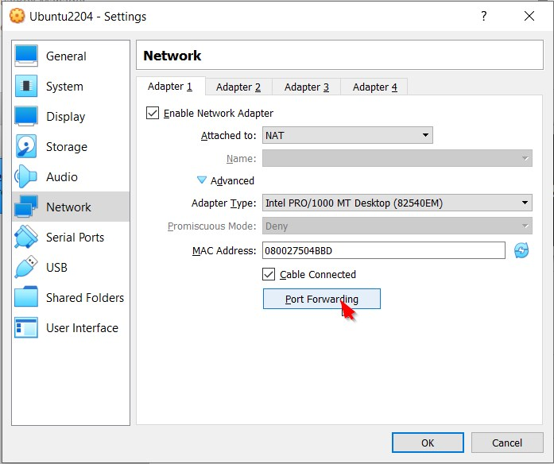

Then I set rules like this:

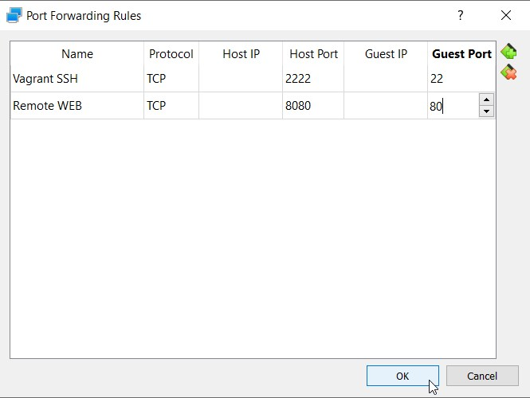

## Step 2 - Instal integration tools

with the OS installed, I followed manual and installed linux kernel headers and the basic developer tools
```
sudo apt-get install linux-headers-$(uname -r) build-essential dkms
```

Then with Guest Addition CD inserted I run following command to install it on the system
```
sudo mkdir /media/cdrom
sudo mount /dev/cdrom /media/cdrom
sudo sh /media/cdrom/VBoxLinuxAdditions.run
```
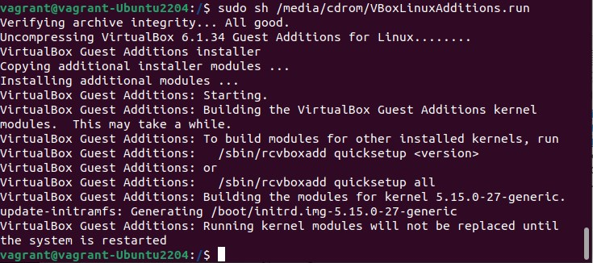

Last action in this step is to unmount CDRom, eject it and reboot VM
``` 
sudo umount /media.cdrom
eject
sudo reboot
```


## Step 3 - Username and password
Since my user and password were set properly during the installation, I don't have much to do with that


## Step 4 - Configure SSH

This time I will follow next manual:
> https://www.vagrantup.com/docs/boxes/base

First I have to install SSH server
```
sudo apt update
sudo apt install openssh-server
```
After that I was able to login to the VM with username and password ( I used "VirtualBox Host-Only Ethernet Adapter" IP address as a destination, and port 2222 which was set in port redirection policy )

To be completely sure that I'm on a proper VM, I have created a text file in vagrant user home directory
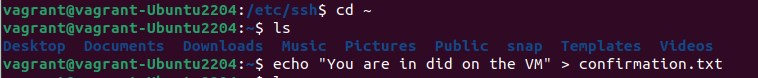

and after a successful login (using username and password) I found that file
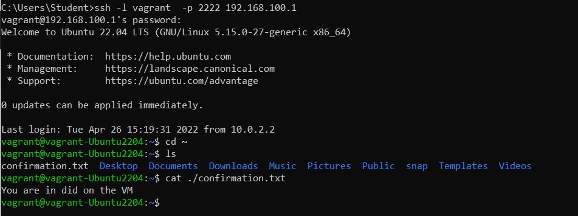


The only thing left is to prepare VM to login with use of the insecure key pair for SSH communication

I copied the public key form 
> https://raw.githubusercontent.com/hashicorp/vagrant/main/keys/vagrant.pub

to ~/.ssh/authorized_keys file on the VM

To achieve this I simply copied the key from GitHub repository:

```
cd ~
cd .ssh
wget --no-check-certificate https://raw.githubusercontent.com/hashicorp/vagrant/main/keys/vagrant.pub -O authorized_keys
```

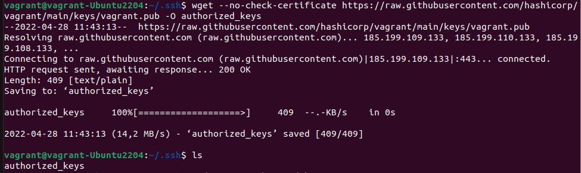


Then I changed permissions with
```
cd ~
sudo chmod 0600 ~/.ssh/authorized_keys
sudo chmod 0700 ~/.ssh

```

Then I changed entries in the sshd_config 
```
cd /etc/ssh
sudo nano sshd_config
```

I have changed following lines
- uncommented and added %h/ (to point logged user to home directory)

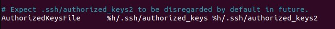

- uncommented (checked) to disable use of DNS

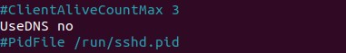

 - disable use of pyt (Vagrant does not use it)

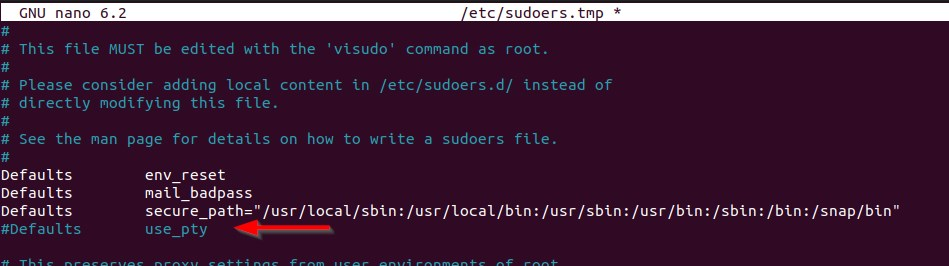


## Step 5 - Password-less Sudo

To edit the sudo policy I use the visudo policy editor 
```
sudo visudo
```

Following the manual I added following line at the end of the file
``` 
vagrant ALL=(ALL) NOPASSWD: ALL
```
To check the configuration I have logged in as vagrant and I was able to sudo without password
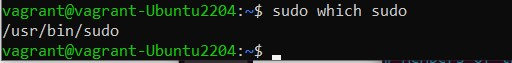


# Export VM and import it as a Box

To export VM I used following command. 

vagrant-Ububtu2204 is the name of VirtualBox VM

--output specifies where packager should put the box image. I just wanted to test how to change name of the result box and at the same time avoid putting image in e.g. user home directory (which is the default place if you don't change VAGRANT_HOME environment variable)

```
vagrant package --base vagrant-Ubuntu2204 --output D:\VagrantBaseBoxes\ubuntu2204
```


Now I can add this image as a box with following command:
```
vagrant box add D:\VagrantBaseBoxes\ubuntu2204 --name myUbuntu2204
```

Now I have new box on my list

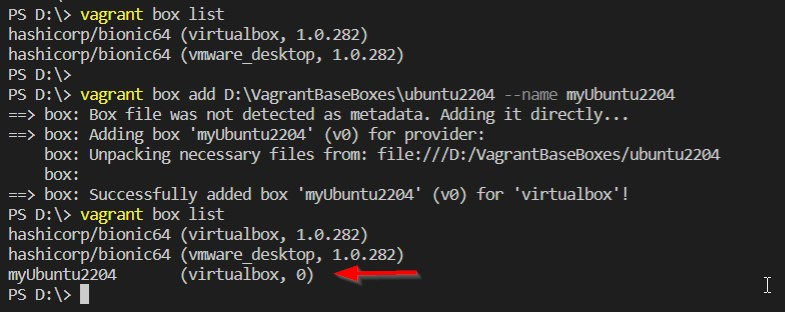


Now is time to run clone and verify if all went well (and my time was not wasted :smile: )
